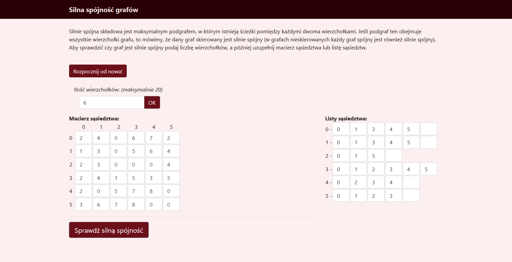
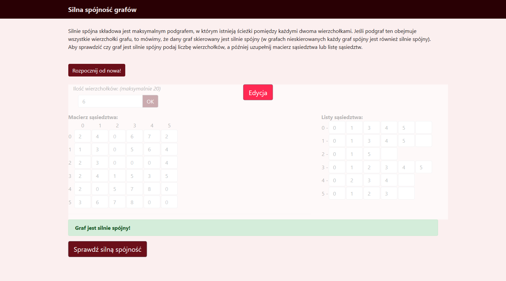

# GraphProjekt



## Instlacja i uruchomienie
Do instalacji zależności i uruchomienia programu potrzebny jest Node.js (wraz z npm) oraz yarn.

W przypadku braku `yarna` instalujemy go globalnie komendą `npm install -g yarn`

1. Klonujemy projekt (`git clone ...`)
2. Za pomocą `yarna` instalujemy zależności (`yarn install`)
3. Uruchamiamy projekt (`yarn start`)





## Notatki
#### Przydatne tutoriale i linki

- O co c'mon z Connect() => https://www.sohamkamani.com/blog/2017/03/31/react-redux-connect-explained/
- React i Bootstrap 4 => https://reactstrap.github.io/

#### Wrzucenie strony na gh-pages można wykonać komendą (w systemie wymagany jest zainstalowany yarn):
```
yarn deploy
```
